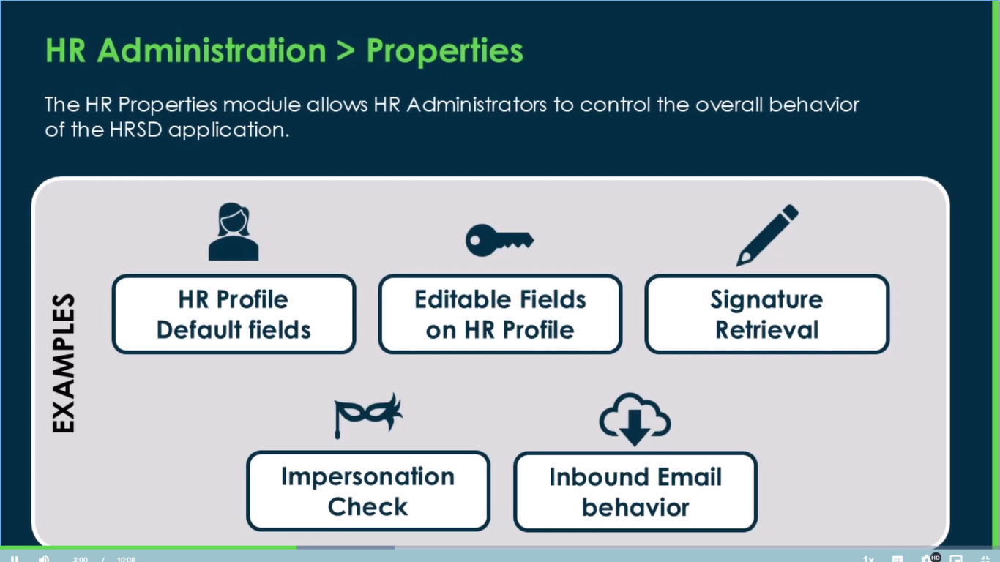

#### **HR Administration** --> Properties

### Important Settings (HR Admin Properties)

These are like the main control switches for the HR system. The HR administrator can turn them on or off to control important functions.

#### 1. Impersonation Check (This is Very Important for Security)

This is a critical security lock to protect private employee information.

*   **The Problem:** In any company, there is a "System Administrator" (or "sysadmin") who has master control over all computer systems. This person's job is to fix technical issues, not to look at employee salaries or private complaints.
*   **The Risk:** A sysadmin could "impersonate" (act as or pretend to be) an HR manager to gain access to confidential HR data that they are not supposed to see.
*   **The Solution:** The **Impersonation Check** is a feature that, when turned on, blocks the sysadmin from being able to impersonate HR users to see protected information. It ensures that only authorized HR professionals can see sensitive data.

#### 2. Other Important Settings

*   **Editable Fields:** This setting controls what information employees are allowed to change on their own profiles. For example, a company might allow an employee to update their home address but not their job title or salary.
*   **Signature Retrieval:** This allows the system to securely store a person's digital signature. This is useful for signing documents online without needing to print and scan them.
TODO: Explore Signature Retrieval
*   **Inbound Email Behavior:** This is a smart feature that automatically manages emails sent to the HR department. When an employee emails HR with a request, the system can automatically turn that email into a formal "case" or ticket. This ensures the request is tracked and doesn't get lost.

#### **System Applications ** --> Application Restriced Caller Access

Of course. Here are simple notes on **Restricted Caller Access (RCA)**, explaining it as a security guard for different parts of your ServiceNow system.

### What is Restricted Caller Access (RCA)?

Imagine ServiceNow is a big office building with different departments in separate, secure rooms.
*   **HR Department** is one room.
*   **Customer Service Department** is another room.

Each room is an **"Application Scope."** They are designed to keep their information separate and secure.

**Restricted Caller Access (RCA)** is the security guard at the door of each room. It decides if a script or action from one department (like Customer Service) is allowed to enter another department's room (like HR) to get information or perform a task.[3][5]

### The Two Modes of the Security Guard

RCA has two ways of working, which you can choose from.[5]

1.  **Tracking Mode (The "Note-Taker")**
    *   **What it does:** In this mode, the guard doesn't block anyone. It just watches who comes to the door and writes down every attempt to enter. It notes *who* tried to enter, *where* they came from, and *what* they wanted to do.
    *   **When to use it:** Use this during **development and testing** (in non-production systems). It helps you see all the connections your applications need to make. You can then review the list and approve the connections that are necessary and safe.

2.  **Restriction Mode (The "Bouncer")**
    *   **What it does:** In this mode, the guard is strict. It has a list of approved visitors. If someone tries to enter and they are not on the list, the guard **denies access** and blocks them completely.
    *   **When to use it:** This is the **recommended mode for your live (Production) system**. By this stage, you should have already approved all the necessary connections. This mode enforces your security rules and protects your application's data.

### How to Manage RCA (Working with the Security Guard)

1.  **Viewing the Logs:**
    *   You can find the "Application Restricted Caller Access" list by searching for "caller" in the navigation menu.
    *   This list shows every attempt made by one application scope to access another. The speaker likes to rearrange the columns to see the **Target** (the room being entered), the **Status** (Allowed, Requested, or Denied), and the **Source** (who is trying to enter).
    *   The "Status" is like the door—it shows if it's open or closed for that specific interaction.

2.  **Approving or Denying a Request:**
    *   When you see a request with the status "Requested," you need to decide whether to allow it.
    *   You should investigate it first. For example, check the script that is trying to get access and what it wants to do (e.g., just "read" data, or "create/write" data).
    *   If you decide to approve it, you change its status to **"Allowed."**

3.  **Making Changes Requires the Right Permissions:**
    *   To change a status from "Requested" to "Allowed," you must have the right permissions. Specifically, you need to be in the **correct application scope**.
    *   For example, if a script from the "Global" scope wants to access something in "HR Lifecycle Events," you must switch your user profile into the "HR Lifecycle Events" scope to approve that request. If you don't have the right admin rights (like "HR LE Admin"), you won't be able to approve it.

### How to Switch Between Tracking and Restriction Mode

You don't do this for individual requests. You set the mode for the entire application.

*   Go to the application's main record page (you can find it under "System Applications").
*   Under "Related Links" at the bottom, you will find options like:
    *   "Move to tracking"
    *   "Move to restricted"
*   This allows you to switch the entire application's security mode.

### [Move restricted to tracking]()
This action **lowers** your application's security.

*   **Before:** The application is in **Restriction Mode**. This means it actively blocks any unauthorized scripts or applications from accessing its data. It's like having a bouncer at the door who only lets in people on the guest list.
*   **What this button does:** It switches the application to **Tracking Mode**.
*   **After:** The bouncer is replaced with a friendly note-taker. The application will now **allow all access attempts** from other scripts and applications, but it will create a log entry for every single one. It stops blocking and starts recording everything.[3]

**When would you use this?**
You would typically do this in a non-production environment (like development or testing). If something in your live system isn't working because it's being blocked, you might temporarily switch to tracking mode in a test system to identify exactly what is trying to get access so you can create a proper rule for it.

### [Move tracking to restricted]()
This action **increases** your application's security. It's the most important step before your application goes live.

*   **Before:** The application is in **Tracking Mode**. It's allowing access from other applications and just logging the activity.
*   **What this button does:** It switches the application to **Restriction Mode**.
*   **After:** The note-taker is replaced with a strict bouncer. The application will now **enforce the rules** you have set in the Restricted Caller Access list. It will **deny** any access attempt that doesn't have a corresponding rule with a status of "Allowed".[5]

**When would you use this?**
This is the **recommended and essential step** for a production (live) environment. After you have used tracking mode to identify and approve all the necessary cross-application communications, you switch to restriction mode to lock down your application and protect its data from any unwanted access.

### Simple Analogy

| Mode | Security Guard's Job | Result | Best Used For |
| --- | --- | --- | --- |
| **Tracking Mode** | Writes down everyone who comes to the door but lets them all in. | High visibility, low security. | Development & Testing |
| **Restriction Mode** | Checks a guest list and blocks anyone not on it. | Low visibility (of new attempts), high security. | Production (Live System) |

So, "Move restricted to tracking" **opens the doors for investigation**, and "Move tracking to restricted" **locks the doors for protection**.

'**/esc?id=esc_sc_category** to view all available catalogs of the current portal'