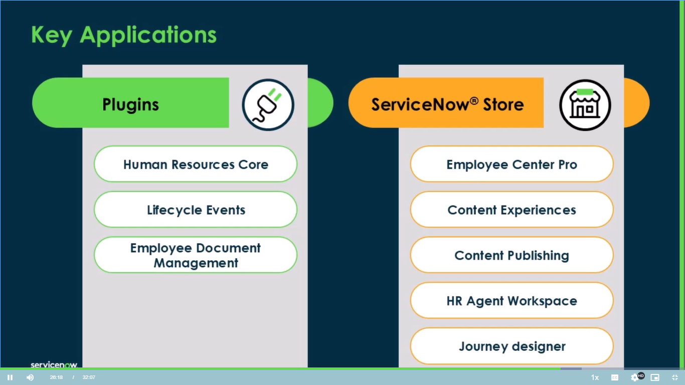

# ServiceNow HR Service Delivery - Summary

## Current HR Situation
- In many companies, when employees need help, they face **too many systems and complex processes**.  
- Common needs (like leave, onboarding, benefits, offboarding) often involve **multiple departments** – IT, HR, Finance, Facilities, Legal.  
- Each department has its own **portal or process**, so employees get a **fragmented and frustrating experience**.  
- Employees are forced to figure out *where to go* (IT? HR? Finance?) instead of just getting help quickly.  

---

## Problems for HR Professionals
- HR staff often depend on **emails, phone calls, and spreadsheets** for daily work.  
- Most of their time is spent on **repetitive, administrative tasks**:  
  - Answering the same benefits questions.  
  - Manually updating employee details in systems.  
  - Coordinating onboarding tasks.  
- Studies show **30% of HR’s time** is wasted on this type of work.  
- The problem becomes **worse when multiple systems and departments are involved**.  

---

## How ServiceNow HR Service Delivery Helps
- Gives employees **one single place** to:  
  - Find answers.  
  - Request services or items.  
  - Chat with an HR professional.  
- Hides the complexity of back-end systems from employees.  
- Makes HR’s job easier by:  
  - **Automatically categorizing cases** with predictive intelligence.  
  - **Assigning cases** to the right department or person.  
  - **Integrating with other systems**, so updates in ServiceNow automatically update the main system of record.  

---

## In Short
Employees currently face confusion and frustration with multiple systems. HR spends too much time on repetitive admin work.  
**ServiceNow HR Service Delivery fixes this by giving a single, simple place for employees and automating work for HR.**

