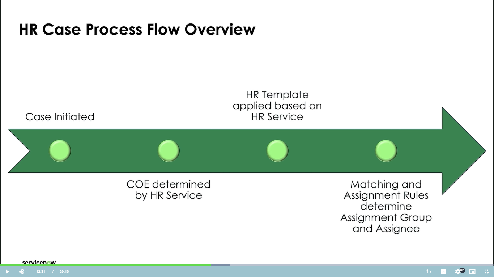

## 🛠️ How HR Cases are Created

There are two main ways a case is started:

### 1. By the Employee (Self-Service)
The employee uses the **Employee Center Pro** (a website portal) like an online store:

* **Browsing:** They select an **HR Topic** (e.g., Pay and Time) to find what they need.
* **Ordering:** They click on a specific **Catalog Item** (the HR service, e.g., "Payroll Discrepancy").
* **Self-Help:** The form suggests related **Knowledge Articles** (FAQs/policies). The goal is to solve the issue without creating a case.
* **Submission:** If they submit, the case is immediately **auto-assigned** to an HR agent with the right skills.

### 2. By the HR Professional
An HR agent can open a case for an employee in several ways:

* **Directly:** Using the "New Case" button from the main navigation or any HR case list.
* **From a Profile:** Clicking "Create New Case" on an employee's **HR Profile** (e.g., if they see wrong information).
* **From Chat:** Converting a chat conversation with a **Virtual Agent** into a formal case.

---

## 🧐 How the Agent Manages the Case

The HR agent views the case on their internal **Platform** or in the **HR Agent Workspace** (a single dashboard).

* **Assignment:** A **Required Skill** (like "Payroll") is attached to the service. This skill determines which **Assignment Group** gets the case (e.g., HR Tier 1), leading to **auto-assignment** to a specific agent (e.g., Tammy).
    * *Self-Correction:* If an HR Admin wants to take the case, they must first **remove the Assignment Group** before trying to assign it to themselves if they aren't part of that group.
* **Communication:**
    * **Comments:** Visible to the employee in the portal.
    * **Work Notes:** Internal notes, hidden from the employee.
* **Process:** The agent clicks **Start Work** (changing the status to "Work in Progress") and follows the **Fulfillment Instructions** and **Checklist**.
* **Closure:** Once resolved, the agent sets the status to **Close Complete**. The employee is then prompted to accept the solution.

---

## ⚙️ Advanced Configuration and Tools

### Centers of Excellence (COE)
* Instead of putting all HR cases into one giant database table (like IT incidents), HR uses multiple, specialized database tables called **Centers of Excellence (COEs)** (e.g., Total Rewards COE, Payroll COE).
* **Why?** This keeps highly sensitive data (like payroll) separate and allows access privileges to be granted only to the specific HR groups that need it.

### HR Case Templates
* These are like pre-filled forms. An **HR Template** automatically populates fields on a new case (like the Short Description or Skills).
* **Rule:** If a template pre-fills the **Assignment Group** or **Assigned To** fields, the template's choice **overrides** the system's normal Assignment Rules.

### Response Templates
* Pre-written, standardized responses for common situations (e.g., "We have received your tuition request").
* They use **variable inserts** (placeholders like `${Subject_Person}`) that automatically fill with the correct data when pasted into a comment.

### Bulk Case Creation
* A tool to handle widespread issues (e.g., a massive payroll error affecting 10 employees).
* An agent creates one **Parent Case**, defines a **User Segment Group** (using filters like Part-Time **Employment Type**), and the system automatically creates a separate **Child Case** for every affected employee.
* Any update or closure on the **Parent Case** automatically updates all **Child Cases**.

### Case Creation Configuration
* Allows HR to customize the form used to create a case, especially when an agent creates one for an employee.
* **Benefit:** It can be configured to **mandate data collection up front** (e.g., requiring school name and cost for a tuition request) *before* the case is officially opened, preventing delays and missed deadlines (SLAs).

---

## 📄 Document Management and Signatures

### Document Templates
* Used to generate documents (like an NDA or I-9 form) within the HR case.
* **HTML Templates:** Simple, customizable documents with text, images, and **signature fields** that can be assigned to a case participant.
* **PDF Templates:** Used for complex, **Adobe fillable documents** that are imported via the **Manage Documents** application.

### E-Signature vs. Digital Signature
* **E-Signature:** The employee types or draws their name and clicks "Accept." It is a basic signature method that **is not legally binding** and has no technology to confirm the identity of the signer or if the document was altered.
* **Digital Signature:** Achieved by integrating with a third party like **Docusign**. This method uses certificate technology to confirm the signer's identity and ensure document integrity, making it **legally binding**.

### Document Workflow
* Documents can be attached to an HR service and generated by the agent.
* For documents requiring **multiple signatures** (like an offer letter), the HR service is configured to create an **HR Task** for each required signer, ensuring the document progresses sequentially until the last person signs.