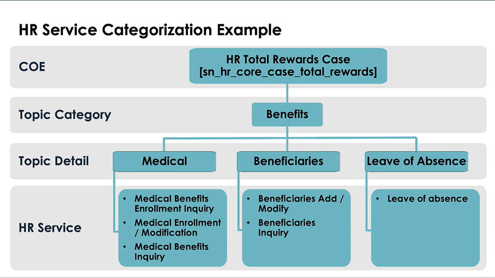

## 🌟 What is an HR Service?

An **HR Service** is the **starting point for all HR case creations** and defines what the HR department will do.

* It is the **part of the request process that employees see** (e.g., "Request a Pay Stub," "Overseas Transfer Inquiry").
* It acts as a container, defining the **actions, fulfillment instructions, templates, and routing rules** needed to resolve the employee's request.
* HR Services must be created whenever a new, specific action or request requires follow-up from HR.

***

## 🧩 HR Service Categorization Structure (COE)

HR Services are organized in a strict hierarchy for security, reporting, and proper data separation:

1.  **Center of Excellence (COE) Table:** The highest level (e.g., Payroll COE, Total Rewards COE). This is the underlying **database table** where the case record physically sits.
2.  **Topic Category:** A broad category within the COE (e.g., Benefits).
3.  **Topic Detail:** A specific sub-category within the Topic Category (e.g., Dental within Benefits).
4.  **HR Service:** The specific request item that sits under a Topic Detail (e.g., "Dental Benefits Inquiry").

**Rule:** When you create an HR Service, the first step is to check if a suitable **Topic Detail** exists. Choosing the Topic Detail automatically links the HR Service to the correct **Topic Category** and **COE table**.

***

## 🛠️ Methods for Creating an HR Service

There are two ways to create an HR Service, each with a different primary purpose:

| Method | Primary Purpose | Key Action/Benefit |
| :--- | :--- | :--- |
| **Manage HR Catalog** | Used when the service **MUST be visible** to the employee on the portal. | Acts as a **shortcut** and automatically creates the necessary **Record Producer**. |
| **Manual Creation** | Used for **internal-only** HR actions or to fully understand all components. | Allows for manual configuration of all fields. The **Record Producer field must be left blank** to hide it from the Employee Center. |

***

## 📋 Key Components and Configuration Requirements

When manually creating an HR Service in the **HR Service Configuration** application, these fields are critical:

### 1. Visibility and Access
* **Record Producer Field:** If this field is **BLANK**, the service **will not appear** in the Catalog on the Employee Center (good for internal services like "Merit Increase Submission"). If it has a value, it will appear.
* **HR Criteria:** Used to **lock down access** to the service. For example, creating a criterion that excludes certain countries means only permitted employees can see and use the "Overseas Transfer" service.

### 2. Fulfillment and Routing
* **Fulfillment Type:** The core decision on how the case will be handled. The simplest is **Manual**; others include **Flow** and **Advanced** (and **Lifecycle Events** for very complex services).
* **Template Field:** Will be used later to automatically populate certain field values on the case (e.g., the Short Description or Skills).
* **Opened For / Approver View / Subject Person:** Default settings selected here ensure these people and their views are automatically configured when the request is created.

### 3. Agent Guidance
* **Fulfillment Instructions:** Text-based guidance for the HR agent on what steps to take. They can be **conditioned** to appear based on criteria (e.g., case location) and can include links to **Knowledge Articles**.
    * *Ordering:* If multiple instruction sets apply, the **Order field** (lowest number displays at the top) determines their sequence.
* **Checklist:** A list of items for the agent to check off (e.g., "Get approval from X manager") to ensure all required steps are complete.
* **Skills:** Although not set on the service itself, the underlying skill must be created, assigned to an HR Group, and then used for **auto-assignment** to the correct agent.

### 4. Search and Reporting
* **Badge Field:** Used for reporting purposes to categorize case types (e.g., HR, IT) and track volume.
* **Short Description (via Template):** This field is vital because its content is used to power the search for **Related Knowledge Articles** that appear at the bottom of the agent's case form. It should be pre-populated by a template to ensure accurate search results.
* **Tasks:** Used when the HR agent **cannot complete the service alone** and needs actions from others (e.g., signature from a manager, or a required action from the employee).

***

## 📝 Troubleshooting Assignment (Why did it go to HR Tier 1?)

If a new case goes to an assignment group (like HR Tier 1) even though no skills were added:

1.  **Default Assignment Rule:** A system rule likely says: "If no other condition matches, send the case to HR Tier 1."
2.  **Template Override:** (Less likely in this demo) A **Template** could have filled in the assignment group. Since templates win, they override any assignment rules.