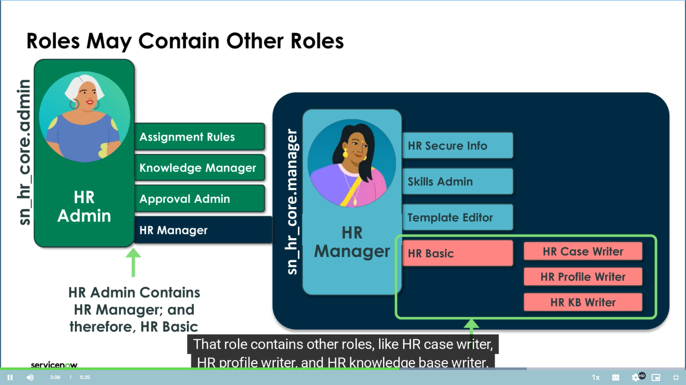
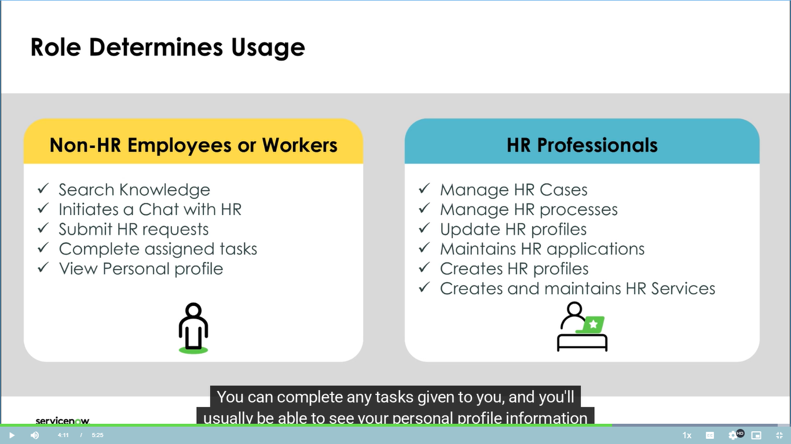
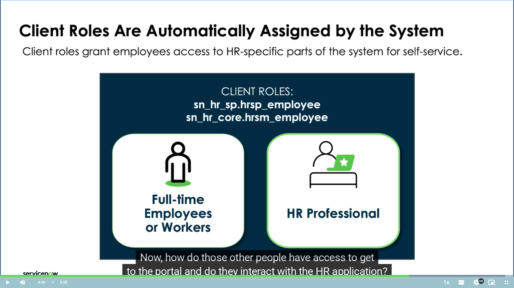

# ServiceNow HRSD: Groups and Roles for Access Management

This document summarizes the core concepts of how ServiceNow HR Service Delivery (HRSD) manages access to sensitive HR information using a structured system of **Groups** and **Roles**.

---

## 1. HRSD Access Management Summary

ServiceNow enforces access control by following a structured, three-step process:

1.  **Group Creation:** An administrative **group** is established (e.g., "HR Agents" or "HR Admins").
2.  **User Assignment:** **Users** (employees) are added to this group.
3.  **Role Assignment:** A **relevant role** is assigned to the group.

This structure ensures that all users added to a group automatically inherit the permissions associated with the assigned role.

### Key Access Principles:

| Concept | Description |
| :--- | :--- |
| **Role Permissions** | Roles grant permissions to use specific applications or access certain modules within those applications, controlling what data a user can see and what actions they can perform. |
| **Dynamic Access** | Access is managed by group membership. Users **gain** access when added to a group and **lose** access (the associated roles) when removed from a group. |
| **Predefined Roles** | ServiceNow provides predefined roles to ensure the appropriate, secure, and least-privilege level of access to applications, modules, and underlying data tables. |

---

## 2. Key HR Roles in ServiceNow

The following are the essential HR roles discussed in the training module:

| Role Name | Assigned To | Primary Access and Functionality | Limitations/Scope |
| :--- | :--- | :--- | :--- |
| **HR Basic Role** | **HR Agents** | **Minimum required role**. Allows agents to create, work on, and close cases, as well as complete related tasks. | Access is generally **limited to the specific cases they handle**. They **do not have access to management modules**. |
| **HR Manager Role** | **HR Managers** | Allows access to **additional management-type modules** within the HR application. | Grants a broader view than HR Basic, but typically less than Admin access. |
| **HR Admin Role** | **HR Admins** | Inherits the ability to **see all modules** within the core HR basic application. | This is the highest level of access for core HR functionality. |

---

## Roles Determine Usage in ServiceNow HRSD

In ServiceNow HR Service Delivery (HRSD), roles govern a user's ability to interact with the system, determining whether they are primarily an HR professional or a general employee (user).

### 1. Access for HR Professionals (With the `HR Basic` Role)

If a user holds the **HR Basic role** (the bare minimum for an HR professional), they have the ability to:

* **Create and manage HR cases and processes.**
* **Look at employee profiles**, and other related HR data.

### 2. Access for General Employees (Without the `HR Basic` Role)

Users *without* the `HR Basic` role (i.e., general employees or non-HR users) can still utilize many HR services through the platform, including:

* **Search the knowledge base** for articles they have permission to access.
* **Go to the portal** (typically the Employee Center) and **initiate a chat with HR**.
* **Select a catalog item** to submit a service request.
* Have **someone else create an HR request for them**.
* **Complete any tasks** assigned to them.
* **See their personal profile information** by visiting the Employee Center.

## 3. Interview Questions and Answers

This section includes practical interview questions based on the HRSD Groups and Roles model, along with detailed answers.

### Foundational Concepts

| Q. No. | Interview Question | Answer |
| :--- | :--- | :--- |
| **1.** | **How does ServiceNow HRSD manage access to HR information?** | ServiceNow manages access by creating **Groups**, assigning **Users** to those groups, and then granting a **Role** to the group. This structure ensures users inherit the necessary permissions based on their function. |
| **2.** | **Explain the three-step structured process ServiceNow uses to grant access (Group $\rightarrow$ User $\rightarrow$ Role).** | 1. **Create Group** (e.g., "Payroll Team"). 2. **Add Users** to that group. 3. **Assign a Role** (e.g., `sn_hr_core.manager`) to the group. The users then automatically inherit the permissions of that role. |
| **3.** | **What is the benefit of assigning a role to a group rather than directly to individual users?** | It is more **efficient** and **scalable**. Access is centrally managed; you only modify one group's role, and all members' access updates instantly. It also simplifies auditing and compliance. |
| **4.** | **What happens to a user's access permissions if they are removed from an HR group in ServiceNow?** | They automatically **lose** the associated roles and, therefore, lose the ability to perform the related tasks or access the functionality tied to that role. |
| **5.** | **Are roles typically predefined, or are they often created on a per-user basis?** | Roles in ServiceNow are generally **predefined** to ensure consistency, security, and the appropriate level of access to applications, modules, and underlying data tables. |

### Specific HR Roles

| Q. No. | Interview Question | Answer |
| :--- | :--- | :--- |
| **6.** | **Which HR role is considered the minimum required for an HR team member in ServiceNow, and what are their primary responsibilities/limitations?** | The **HR Basic Role** is the minimum. It allows agents to **create, work on, and close cases**. The limitation is that their access is generally **restricted to the specific cases they are handling**, and they cannot access management or administrative modules. |
| **7.** | **If an HR Agent needs to view management reports or modules, which role would typically be assigned, and how is this access usually granted?** | The **HR Manager Role** would be assigned. This is granted by **creating a separate group** for managers, adding the user to that group, and assigning the Manager role. |
| **8.** | **What level of access does the HR Admin role provide within the core HR application?** | The HR Admin role grants the ability to **see all modules** within the core HR basic application, giving them the broadest administrative control over the application's configuration and data. |
| **9.** | **Do the Core HR roles (Basic, Manager, Admin) automatically cover access for other HR applications like Lifecycle Events or the Service Portal?** | No. The module states that other applications, such as **Lifecycle Events** and **Service Portal**, have their **own specific HR roles** that must be assigned separately. |

### Practical Application

| Q. No. | Interview Question | Answer |
| :--- | :--- | :--- |
| **10.** | **Imagine you need to onboard 10 new HR Agents. Briefly describe the most efficient way to grant them the necessary access.** | The most efficient way is to ensure a dedicated "HR Agents" **group** already exists with the **HR Basic Role** assigned. You then simply **add all 10 new users** to that existing group. They will automatically inherit the required role and permissions. |
| **11.** | **Why is it important for HR agents with the HR Basic role to have their access limited to only the cases they handle?** | This is crucial for maintaining **data privacy** and adhering to the **principle of least privilege**. It ensures agents only view the highly sensitive HR data (PII) required to complete their specific tasks, reducing security and compliance risks. |

---

### Access for Regular Employees (Non-HR Staff)

If you are a regular employee (not an HR professional), you still need a way to talk to HR and find information.

**What you *can* do (even without the main HR role):**

* Go to the **Employee Center portal** (this is like a website for all employees).
* Start a **chat with HR**.
* **Select a service** from the list (like requesting a leave or updating your address).
* Someone else (like a manager or HR) can **start an HR request for you**.
* You can **complete any tasks** that HR gives you.
* You can **see your own personal information** (like your address or job details) on the Employee Center.

### How Regular Employees Get Access (Client Roles)

The question is: How does the system know you are allowed to see the portal if you don't have the `HR Basic Role`?

1.  **Automatic Role:** When you are set up as an employee in the system, you are automatically given a special type of role called a **"Client Role."**
2.  **Identification:** This Client Role simply *identifies* who you are (e.g., "Full-time Employee").
3.  **Access Control:** The system administrator (the HR Admin or Service Portal Admin) then uses this Client Role to decide **exactly what you can see and do** on the Employee Center portal.
4.  **Example Role:** A common Client Role is called `hrsp.hrsp_employee`. This name comes from the old name for the portal ("HR Portal"), but the role is now used for the newer **Employee Center**.

**In simple words:**

* **HR Professionals** get the `HR Basic Role` (or Manager/Admin role) which lets them *work* on HR cases.
* **Regular Employees** get an automatic **Client Role** which lets them *use* the Employee Center portal to *request* HR services and view their own profile.

