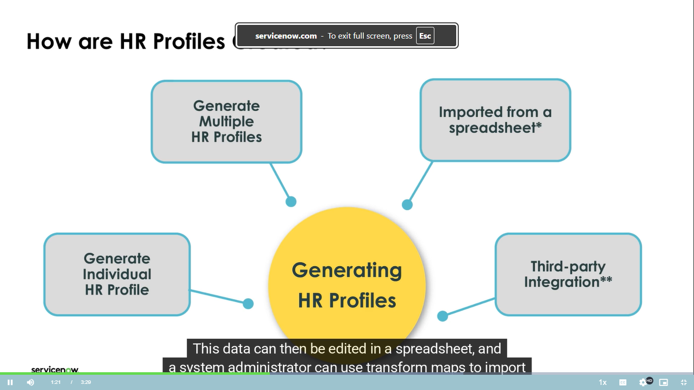

# Understanding and Managing Human Resources (HR) Profiles

An **HR Profile** is a specialized, secure record designed to store an employee's private and sensitive HR-related data within the system. It is distinct from a basic user account and is essential for enabling HR services.

## What is an HR Profile and Why is it Needed?

| Feature | User Account (Basic Record) | HR Profile (Specialized HR Record) |
| :--- | :--- | :--- |
| **Purpose** | Basic system access, login credentials, and user identification. | **Securing and managing an employee's private, sensitive HR data.** Required for HR services. |
| **Data Inside** | Name, login details, basic system permissions. | **Private & Sensitive Data:** Name, gender, Job start date, department, **Tax information**, Contact details, **Family members/beneficiaries**, emergency contacts, and colleagues. |
| **Prevalence** | Every person in the system has one. | **Not everyone has one.** A company may have more User Accounts (e.g., 720) than HR Profiles (e.g., 590). |

---

## How to Create HR Profiles (3 Main Ways)

There are three primary methods for creating an HR Profile, each suited to a different scenario.

### 1. The Manual Way (One by One)

* **Scenario:** Creating a single profile for a new user or managing an existing user's details.
* **New Profile Process:** An HR Admin finds a user without an HR profile (like Abhijeet), clicks **"Create Human Resources Profile,"** and then manually fills in details (e.g., marital status). The rest can be added later by hand or via system connection.
* **Existing Profile:** An HR Admin can view and edit an existing profile (like Able Tutor's) by finding their user account and clicking **"view human resources profile."**
* **Problem:** This method is **very slow** and not scalable for large groups of new employees (e.g., acquiring a new office).

### 2. The Automatic Way (Self-Service Trigger)

* **Scenario:** An employee who has a user account but **no HR Profile** creates an **"HR case"** (asks for HR help).
* **Process:** The system is designed to automatically detect the missing profile. It immediately creates a **basic HR Profile** for the employee, copying whatever information it can from their simple user account to allow the HR case to proceed.

### 3. The Bulk Way (Most Efficient for Many)

* **Scenario:** Onboarding a large group of employees simultaneously (e.g., an acquisition like "Cloud Dimensions").
* **Process Steps:**
    1.  A system administrator adds the new employees to the system as basic **"users."**
    2.  An HR admin uses the **"Generate HR Profiles"** option.
    3.  Use **filters** (e.g., "Company = Cloud Dimensions," "Location = Australia") to select the target group.
    4.  **Very Important Step:** The admin must choose their **"Employment Type"** (e.g., "Full-time"). This is crucial because it assigns the correct roles and permissions for them to use the **Employee Center** portal properly.
    5.  The system confirms the number of profiles (e.g., 45) and creates them all at once.
* **Post-Creation:** These profiles only contain **very limited, copied information**. The admin must still add the full, sensitive private details by uploading a spreadsheet, connecting to another system, or filling it in manually.

---

# 💡 Interview Questions and Simple Answers

## Core Concepts & Distinction

| Interview Question | Simple, Direct Answer |
| :--- | :--- |
| **"What is the difference between a User Record and an HR Profile in the system?"** | "A User Record is a basic account for everyone to log in. An **HR Profile** is a special, secure record that holds an employee's **private HR data** like their start date, department, and family details. Not all users might have an HR profile, but you need one for HR services." |
| **"An employee who does not have an HR Profile raises a request for an HR service. What happens in the system?"** | "The system is designed to handle this. It will **automatically create a new, basic HR profile** for that employee. It will copy as much information as it can from their user record into this new HR profile, allowing the HR case to proceed." |

## Scenario & Process Management

| Interview Question | Simple, Direct Answer |
| :--- | :--- |
| **"Your company has just hired 100 new employees. What is the most efficient way to create HR profiles for all of them? Describe the steps."** | "The most efficient way is to use the **'Generate HR Profiles'** feature. The steps are: First, make sure the system administrator has created user accounts. Then, use the 'Generate HR Profiles' option, filter to select the users, and **critically select their 'Employment Type.'** Finally, run the process to create all 100 profiles at once." |
| **"After using the 'Generate HR Profiles' tool, are the profiles complete? What is the next step?"** | "No, the profiles are not complete. They only contain very basic information copied from the user record. The next step is to populate the rest of the sensitive data, which can be done manually by the HR team, by uploading a spreadsheet with the data, or through an integration with another HR system." |
| **(Additional Question) "Why is selecting the 'Employment Type' a crucial step during bulk profile creation?"** | "Selecting the correct 'Employment Type' (e.g., Full-time, Part-time) is crucial because it assigns the necessary **roles and permissions**. Without this, the new employees will not be able to properly access or use the self-service **Employee Center** portal." |
| **(Additional Question) "Give an example of sensitive data found in an HR Profile that is NOT in a User Account."** | "Sensitive data includes **tax information**, **job start date/department**, and details about **family members/beneficiaries** who receive company benefits." |