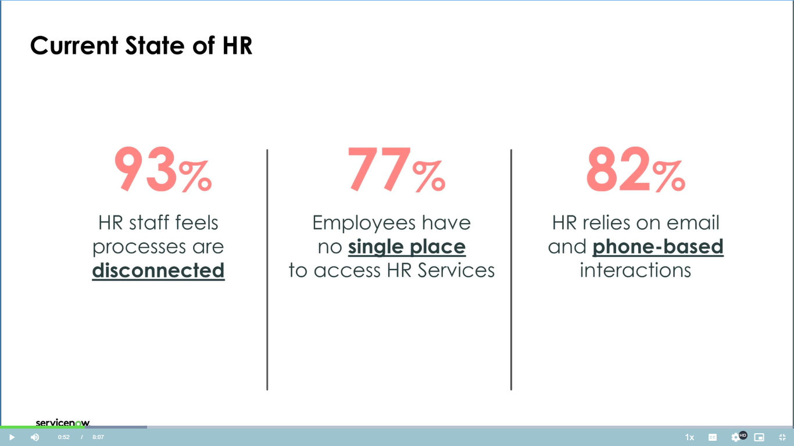
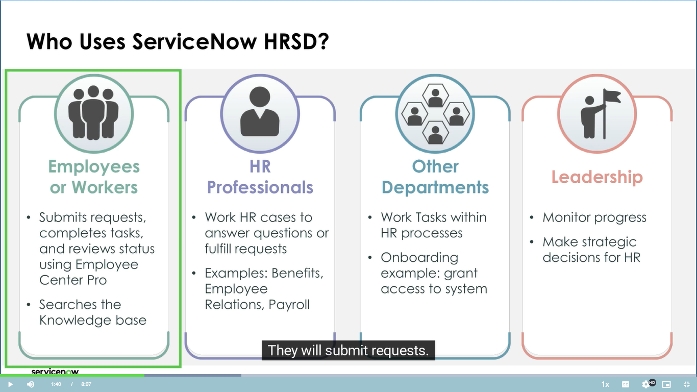
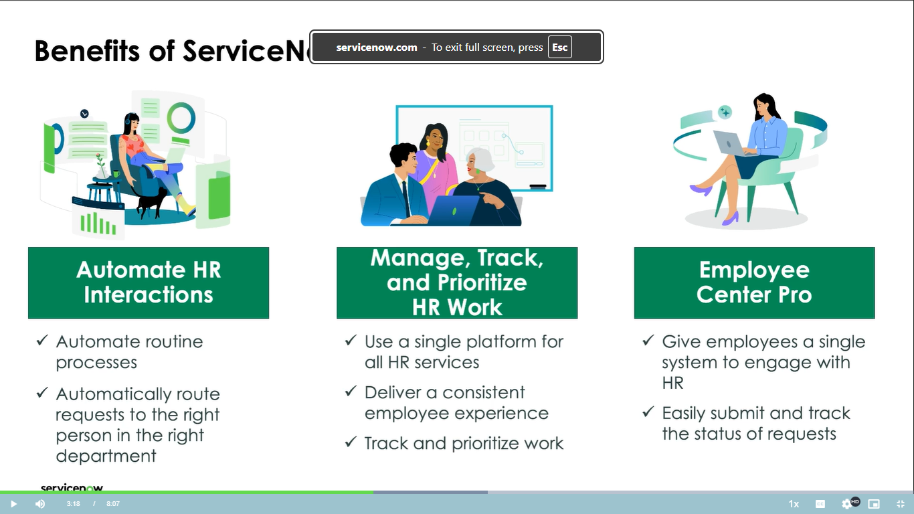

# ServiceNow HR Service Delivery (HRSD) - Complete Guide

## What is HR Service Delivery?

**Simple Explanation**: Think of HRSD as a **one-stop shop** for all HR needs. Instead of employees calling different departments or using multiple systems, they go to one place for everything HR-related.

### The Problem HRSD Solves

**Before HRSD:**

- Employee needs a new ID badge → calls Security directly
- Employee has payroll question → emails Payroll team
- Employee needs laptop → calls IT department
- Employee wants time off → fills paper form for manager

**Result**: Confusion, delays, and no tracking of requests.

**After HRSD:**

- Employee goes to **one portal** or calls **one HR number**
- HR system automatically routes requests to right departments
- Everything is tracked and monitored
- Employee gets updates in one place

## Who Uses HRSD?

### 1. **Employees**

- Submit requests through portal, email, or phone
- Chat with HR professionals
- Complete tasks (like signing documents)
- Read help articles
- Track their request status

**Example**: John needs a parking pass. He goes to Employee Center, clicks "Request Parking Pass," fills the form, and tracks progress.

### 2. **HR Professionals**

- Receive and work on employee cases
- Create tasks for other departments
- Provide guidance to employees
- Monitor case progress

**Example**: HR receives John's parking pass request, creates a task for Facilities team, and keeps John updated.

### 3. **Other Departments**

- Receive tasks from HR cases
- Complete assigned work
- Update task status

**Example**: Facilities team gets the parking pass task, assigns John a spot, and marks task complete.

### 4. **Leadership**

- View reports and analytics
- Monitor performance metrics
- Make data-driven decisions

**Example**: HR Director sees that badge requests take 5 days on average and decides to streamline the process.

## Key Benefits of HRSD

### 1. **Automation**

- Automatic approvals
- Task creation
- Email notifications
- Smart routing to right person

**Example**: When someone requests maternity leave, the system automatically:

- Sends approval to manager
- Creates task for payroll to update benefits
- Notifies IT to extend laptop access
- Schedules check-in reminders

### 2. **Single Platform**

- One place for all HR services
- Same tools across all ServiceNow apps
- Consistent experience

### 3. **Smart Assignment**

- Cases go to right HR person based on skills
- Load balancing
- Priority routing

**Example**: Immigration questions → Global Mobility specialist, Benefits questions → Benefits team

## HRSD Components

### Core Components (Included for Everyone)

#### 1. **HR Case Management**

- Create and track HR requests
- Assign work to people
- Monitor progress

**Example**: "Request Salary Certificate" case goes through approval, generation, and delivery.

#### 2. **Knowledge Management**

- Store help articles
- Self-service information
- Search capabilities

**Example**: Article titled "How to Update Emergency Contact" helps employees solve issues themselves.

### Optional Add-on Components

#### 1. **Employee Center Pro**

- Modern web portal for employees
- AI-powered chat and search
- Service catalog
- Request tracking

**Example**: Employee logs in, searches "maternity leave," finds policy article, then submits leave request if needed.

#### 2. **Lifecycle Events**

- Automates complex multi-step processes
- Coordinates multiple departments
- Tracks milestones

**Example Process - New Employee Onboarding:**

- HR creates offer letter task
- IT prepares laptop and accounts
- Facilities assigns desk
- Manager prepares welcome package
- New hire completes paperwork
- All tracked with due dates and reminders

#### 3. **HR Integrations**

- Connects to payroll systems
- Links with background check vendors
- Integrates with document signing tools

**Example**: Name change in HRSD automatically updates payroll system and email accounts.

#### 4. **HR Platform Analytics**

- Pre-built dashboards and reports
- Performance metrics
- Trend analysis

**Example Metrics:**

- Average case resolution time
- Most requested services
- Team workload distribution

#### 5. **Employee Document Management**

- Create document templates
- Generate letters automatically
- Secure document storage

**Example**: Generate employment verification letter using template with employee data auto-filled.

## Security and Privacy

### Scoped Applications

- **What it means**: HR data is isolated and protected
- **Why important**: Confidential employee information stays secure
- **How it works**: Only authorized people can access HR data

### Special Security Feature

- System administrators (who normally see everything) can be **blocked** from viewing HR cases and employee profiles
- They can still create HR cases like regular employees
- But they cannot see confidential HR data

**Example**: IT admin can maintain the system but cannot open Jane's harassment complaint case.

## Administrative Roles

### 1. **HR Admin**

- Controls HR Core application
- Manages cases, services, profiles
- Cannot control other HR apps without additional roles

### 2. **Lifecycle Events Admin**

- Controls onboarding, offboarding processes
- Separate from HR Admin role

### 3. **Employee Center Admin**

- Manages employee portal
- Controls what employees see and can do

### 4. **Integrations Admin**

- Manages connections to other systems
- Controls data flow

### 5. **Employee Document Management Admin**

- Manages document templates and storage

**Important**: Each app has its own admin role. HR Admin cannot control Lifecycle Events without that specific role.

## Real-World Examples

### Example 1: Employee Relocates to Different City

1. **Employee** submits "Office Relocation" request
2. **HRSD** creates main case and multiple tasks:
    - HR: Update address in profile
    - Payroll: Adjust tax withholding
    - IT: Transfer equipment
    - Facilities: Cancel old desk, assign new one
    - Manager: Plan transition
3. **Each team** completes their tasks
4. **Employee** tracks progress in portal
5. **Leadership** sees how long relocations typically take

### Example 2: Performance Review Process

1. **HR** launches annual review lifecycle event
2. **System automatically**:
    - Creates tasks for all managers
    - Sends reminders at intervals
    - Collects completed reviews
    - Generates summary reports
3. **Managers** receive task lists with due dates
4. **Employees** get notifications about review meetings
5. **HR Leadership** monitors completion rates

## Interview Questions and Answers

### Basic Level Questions

**Q1: What is ServiceNow HR Service Delivery?**
**A:** HRSD is a centralized platform that provides employees with a single point of contact for all HR services. It acts as an abstraction layer between employees and multiple HR systems, automating workflows and improving service delivery.

**Q2: What are the core components included with HRSD?**
**A:** Every HRSD customer gets HR Case Management and Knowledge Management. These allow you to create, work on, and track HR cases while providing self-service knowledge articles.

**Q3: What is Employee Center Pro?**
**A:** Employee Center Pro is an optional portal that gives employees a modern web interface to submit requests, search knowledge articles, chat with AI-powered virtual agents, and track their case status.

### Intermediate Level Questions

**Q4: Explain the concept of scoped applications in HRSD.**
**A:** Scoped applications in HRSD provide data isolation and security. They control data flow in and out of HR applications, protecting confidential employee information. Even system administrators can be restricted from viewing HR case data and employee profiles while still being able to create cases like regular employees.

**Q5: How does automation work in HRSD?**
**A:** HRSD automation includes automatic case routing to appropriate HR agents based on skills and workload, approval workflows, task creation for other departments, email notifications, and escalations. For example, a badge request automatically creates a task for the security team while keeping the employee informed of progress.

**Q6: What are Lifecycle Events and when would you use them?**
**A:** Lifecycle Events automate complex, multi-step HR processes like onboarding, offboarding, or employee transfers. They coordinate tasks across multiple departments with proper sequencing, due dates, and dependencies. Use them when a process involves multiple stakeholders and extended timelines.

### Advanced Level Questions

**Q7: How do administrative roles work in HRSD, and why are they separated?**
**A:** HRSD uses separate admin roles for each application (HR Core Admin, Lifecycle Events Admin, Employee Center Admin, etc.) to maintain security and proper access control. An HR Admin cannot control Lifecycle Events without the specific Lifecycle Events Admin role. This separation ensures that administrators only have access to the functions they need and are authorized to manage.

**Q8: Describe how HRSD integrates with other systems and what considerations are important.**
**A:** HRSD uses the HR Integrations application to connect with payroll systems, background check vendors, document management tools, and identity systems. Key considerations include data synchronization, security protocols, error handling, and maintaining data consistency across systems. Real-time vs. batch processing decisions depend on business requirements.

**Q9: How would you measure the success of an HRSD implementation?**
**A:** Success metrics include: case resolution time reduction, employee satisfaction scores, first-call resolution rates, self-service adoption rates, process automation percentage, and cost per transaction. The HR Platform Analytics Content Pack provides dashboards to track these KPIs and identify improvement opportunities.

**Q10: What are the key differences between HRSD and traditional ITSM?**
**A:** While both handle service requests, HRSD focuses on HR-specific processes with enhanced privacy controls, employee lifecycle management, and HR domain expertise. HRSD includes specialized features like employee profiles, confidential case handling, HR-specific workflows, and integration with HR systems that aren't typically found in ITSM.

## Configuration and Customization

### Properties

- Control application behavior
- Set default values
- Enable/disable features

**Example**: Set default case priority or auto-assignment rules.

### Business Rules and Scripts

- Automate data updates
- Enforce business logic
- Trigger notifications

**Example**: When case is resolved, automatically send satisfaction survey.

### Flow Designer

- Visual workflow automation
- No-code/low-code approach
- Drag-and-drop interface

**Example**: Create flow for expense reimbursement approval process.

## Best Practices for Implementation

1. **Start Simple**: Begin with most common HR requests
2. **Focus on Self-Service**: Create comprehensive knowledge base
3. **Automate Gradually**: Add automation as processes mature
4. **Train Users**: Ensure HR staff and employees understand the system
5. **Monitor and Improve**: Use analytics to identify bottlenecks

This comprehensive guide provides the foundation for understanding HRSD concepts, practical applications, and prepares you for both implementation work and interview scenarios.

