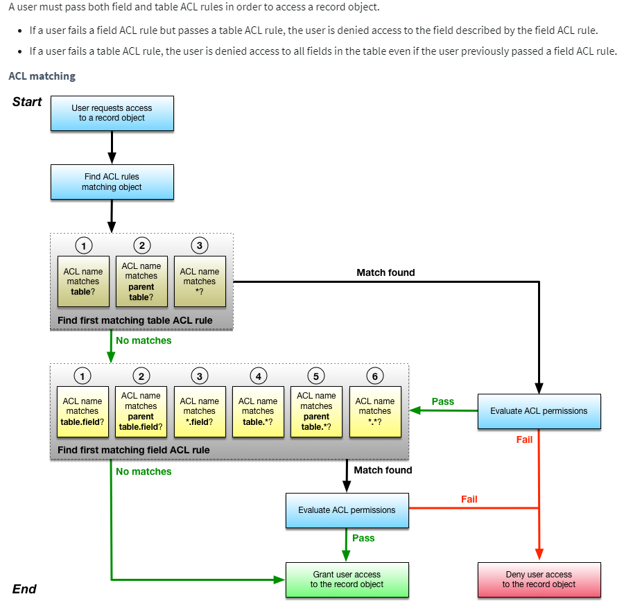

# If No ACL Exists on a Table

If **no ACL exists for a table**, then: there is a wild card acl written on all tables to give read access to admin or based on "glide.sm.default_mode" property  value users will be denied access if it is deny


# Important Rule: ACL Evaluation Order
ServiceNow checks ACLs in this order:

**Table ACL**
```
table.none
```

**Field ACL**
```
table.field
```

**Wildcard field ACL**
```
table.*
```

User **must pass both table AND field level ACL**.

# Default ACL in ServiceNow
> In Servicenow there is a default acl that applies on all tables
This refers to the **`*` ACL**.

Example:
```
*.read
```
This acts as a **global fallback ACL**.

# Your Use Cases Explained
---

# Use Case 1

### ACLs

Table ACL:

```
incident.read → itil role
```

No field ACL.

### Result

Only users with **itil role** can see records and fields.

Reason:
If user fails **table ACL**, they cannot see any fields.

---

# Use Case 2

### ACLs

Table ACL

```
incident.read → everyone
```

Wildcard field ACL

```
incident.*.read → itil
```

### Result

| User    | Result             |
| ------- | ------------------ |
| itil    | Can see all fields |
| no role | Cannot see fields  |

Why?

User passes **table ACL** but **fails field ACL**.

Since **field ACL fails**, no fields are visible.

---

# Use Case 3 (Important One)

### ACLs

Table ACL

```
incident.read → everyone
```

Field ACL

```
incident.description.read → everyone
```

Wildcard ACL

```
incident.*.read → itil
```

### Result

| User    | Result                |
| ------- | --------------------- |
| itil    | sees all fields       |
| no role | sees only description |

Why?

ServiceNow checks **specific field ACL first**.
Order:

```
incident.description
incident.*
```

Since user **passes description ACL**, access is granted.

Wildcard does **NOT override specific field ACL**.

---

# Key Rule

Specific field ACL **takes precedence over wildcard ACL**.

Priority:

```
table.field  (highest priority)
table.*
table
*
```
---

# Visual Diagram

```
User tries to access field

          |
          v
   Check Table ACL
          |
      Pass ?
       /  \
     No    Yes
     |      |
 Access     v
 Denied  Check Field ACL
             |
        table.field exists ?
           /       \
         Yes       No
          |         |
    evaluate     check
    that ACL     table.*
```

# Example
If:

```
table.read → allow
field.read → deny
```

Result:
Field is hidden.

Even though table allows access.

---


# ACL - Order of Excecution
